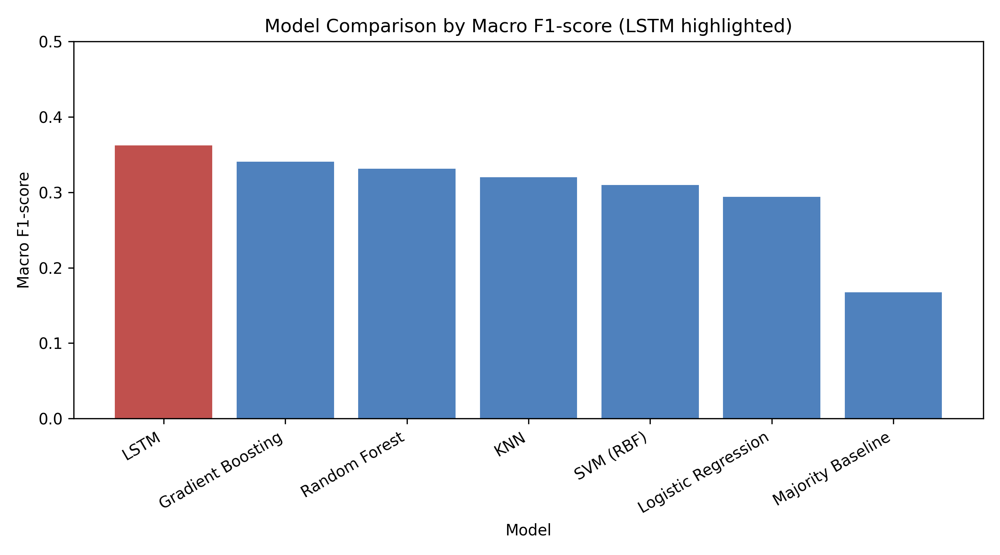
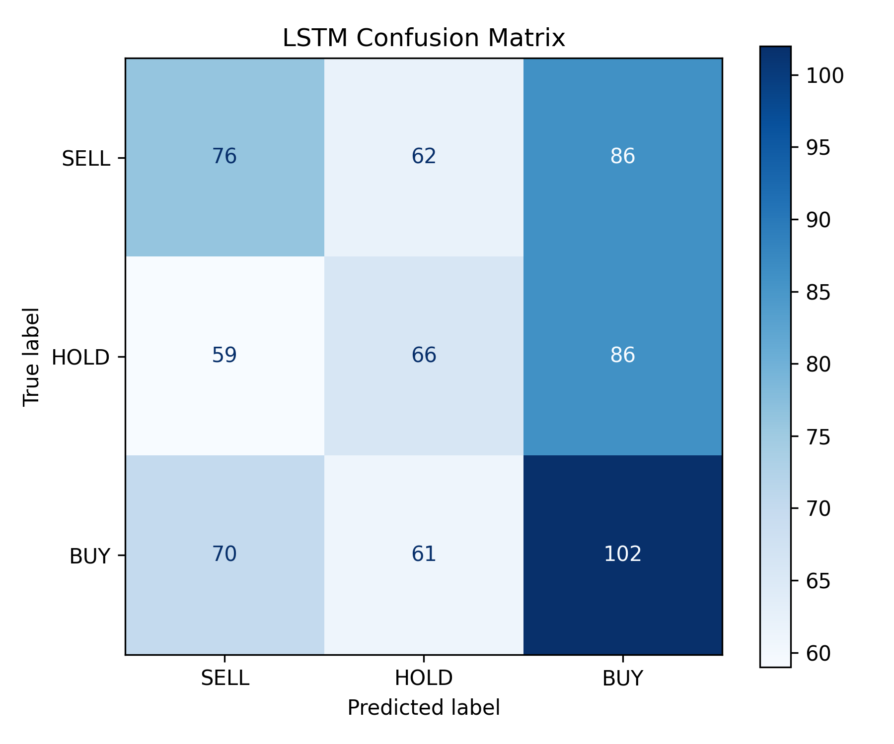
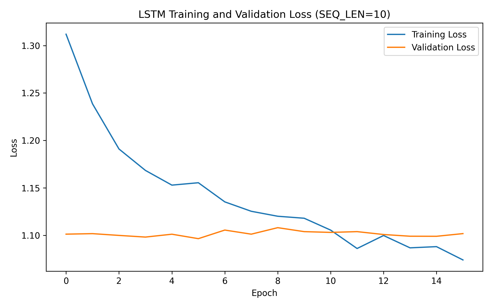
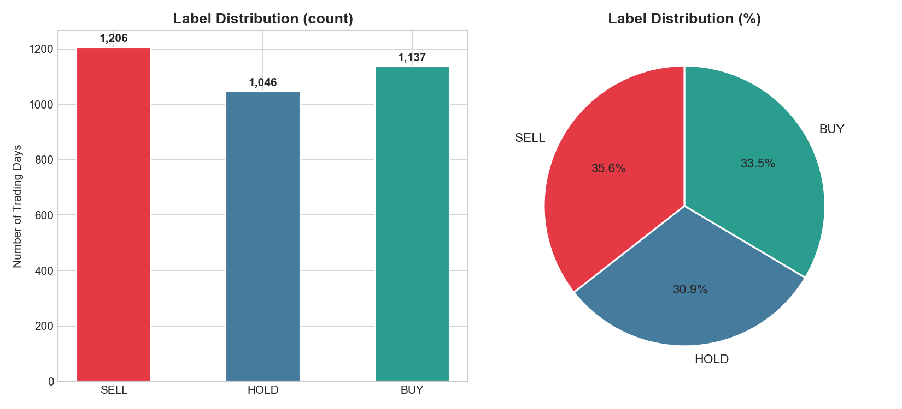
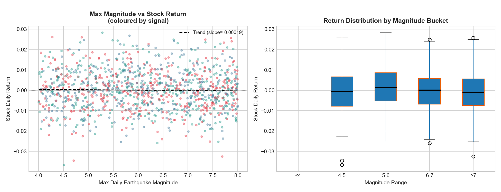
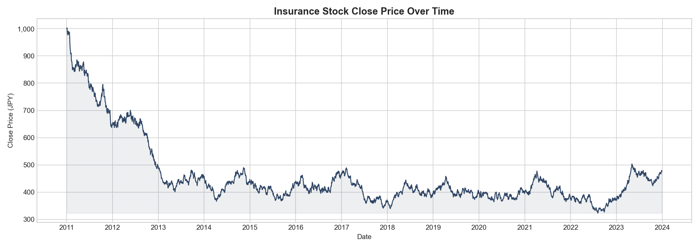
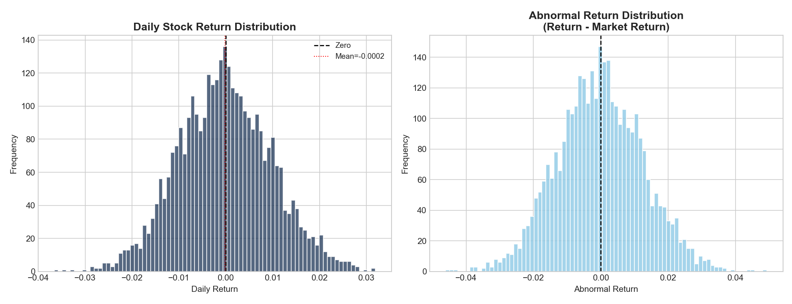
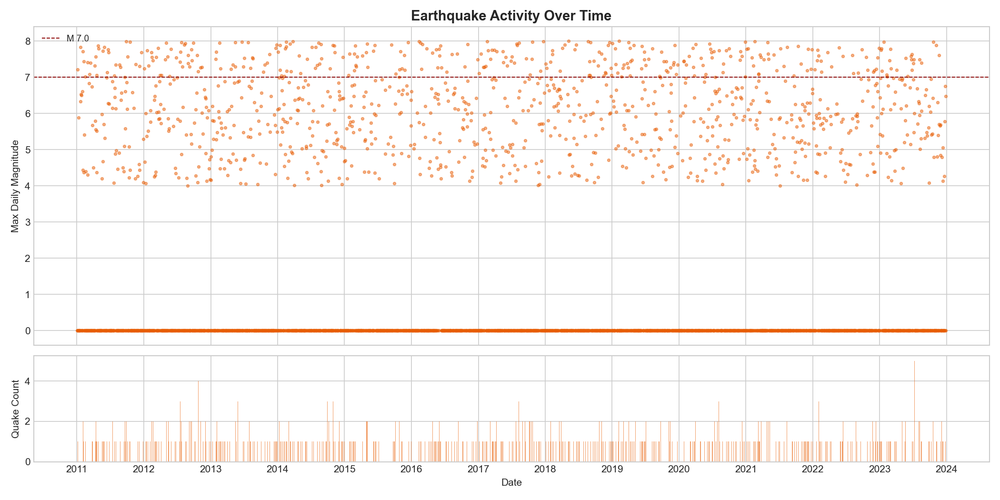
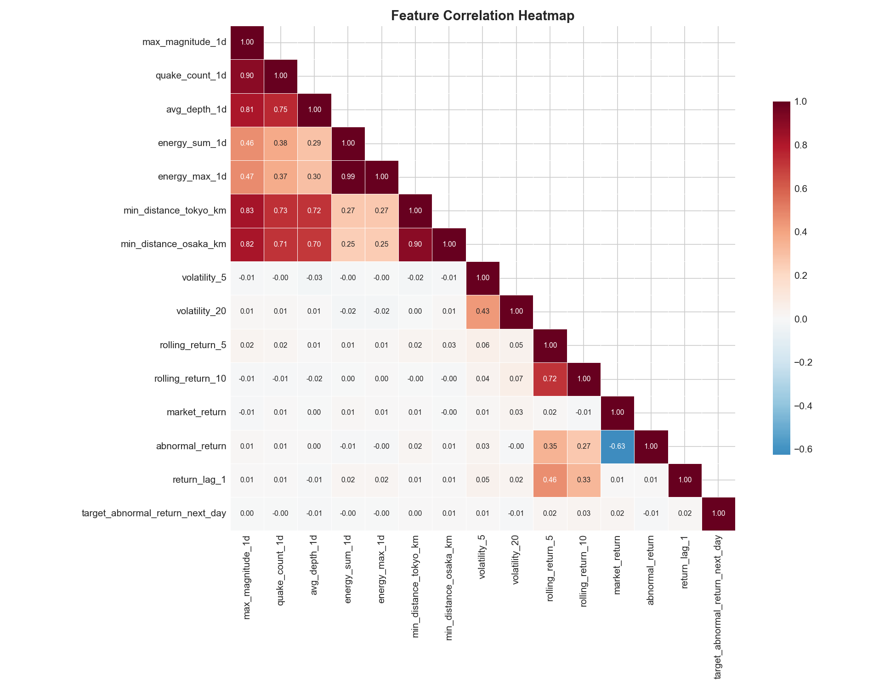
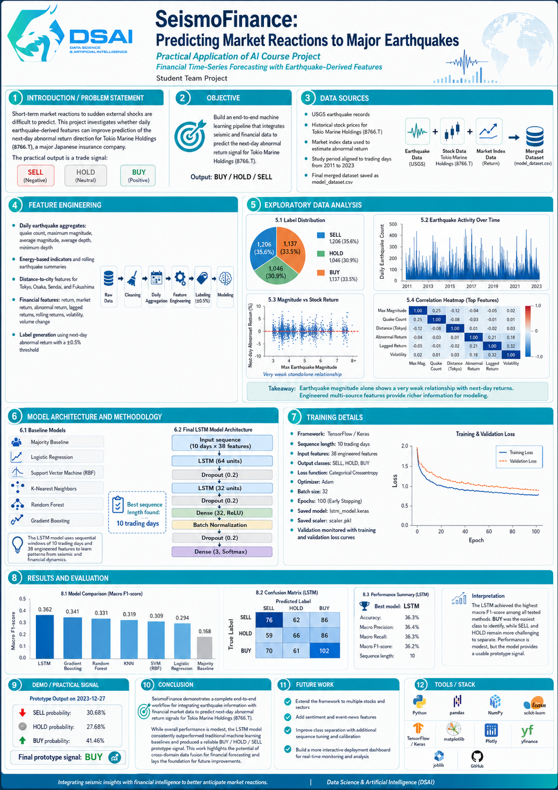

<h1 align="center">🌊 SeismoFinance</h1>

<h2 align="center">Predicting Market Reactions to Major Earthquakes</h2>

<p align="center">
  <b>Financial Time-Series Forecasting with Earthquake-Derived Features</b><br>
  Practical Application of AI Course Project
</p>

<p align="center">
  
  
  
  
  
</p>

<p align="center">
  
  
  
  
</p>

---

<p align="center">
  <a href="#project-overview">Overview</a> •
  <a href="#methodology">Methodology</a> •
  <a href="#model-architecture">Model</a> •
  <a href="#results">Results</a> •
  <a href="#visual-analysis">Visuals</a> •
  <a href="#final-poster">Poster</a>
</p>

---

## Project Overview

**SeismoFinance** is a machine learning project that investigates whether earthquake-related events in Japan can help predict short-term reactions in Japanese insurance stock prices.

The project combines seismic event data, stock market data, and market index data to build a complete prediction pipeline for **Tokio Marine Holdings (`8766.T`)**, a major Japanese insurance company.

The final model predicts the next-day abnormal return direction and converts it into a readable prototype signal:

<p align="center">
  <b>SELL</b> &nbsp;&nbsp; | &nbsp;&nbsp; <b>HOLD</b> &nbsp;&nbsp; | &nbsp;&nbsp; <b>BUY</b>
</p>

> This project is an academic decision-support prototype and should not be interpreted as financial advice.

---

## Problem Statement

Earthquakes are sudden external shocks that may influence financial markets through uncertainty, expected insurance claims, investor risk perception, and broader market volatility.

Japan is a strong case study because it is highly exposed to seismic activity and has a developed stock market with publicly traded insurance companies.

This project asks:

```text
Can earthquake-related data, combined with financial time-series indicators,
help predict the next-day market reaction of a Japanese insurance stock?
```

The prediction task is formulated as a three-class classification problem:

| Class | Signal | Interpretation |
|---:|---|---|
| 0 | SELL | Expected negative next-day abnormal return |
| 1 | HOLD | Expected near-neutral next-day abnormal return |
| 2 | BUY | Expected positive next-day abnormal return |

---

## Project Objectives

The main objectives of this project were to:

- collect earthquake, stock, and market index data
- clean and align datasets by Japanese trading dates
- engineer seismic and financial time-series features
- create Buy/Hold/Sell labels from next-day abnormal return
- train and compare baseline machine learning models
- train and evaluate an LSTM time-series model
- convert model probabilities into a readable decision-support signal
- document the full workflow through notebooks, source code, results, and a final poster

---

## Data Sources

The project uses three main datasets:

| Dataset | Source | Purpose |
|---|---|---|
| Earthquake data | USGS Earthquake Catalog | Provides magnitude, depth, location, event type, and timestamp |
| Stock data | Yahoo Finance | Provides Tokio Marine Holdings (`8766.T`) price and volume data |
| Market index data | Yahoo Finance | Provides Nikkei 225 (`^N225`) market return for abnormal return calculation |

The data is stored in three stages:

```text
data/raw/        Original downloaded datasets
data/clean/      Cleaned intermediate datasets
data/processed/  Final model-ready dataset
```

The final processed dataset is stored at:

```text
data/processed/model_dataset.csv
```

Detailed documentation:

- [`docs/data_sources.md`](docs/data_sources.md)
- [`docs/data_quality_report.md`](docs/data_quality_report.md)

---

## Repository Structure

```text
avaia-seismofinance/
├── data/
│   ├── raw/
│   ├── clean/
│   └── processed/
├── docs/
│   ├── data_quality_report.md
│   ├── data_sources.md
│   ├── final_submission_checklist.md
│   ├── future_work.md
│   ├── methodology.md
│   ├── model_architecture.md
│   ├── problem_definition.md
│   ├── results_summary.md
│   └── team_contributions.md
├── models/
│   ├── lstm_model.keras
│   └── scaler.pkl
├── notebooks/
│   ├── archive/
│   ├── 01_data_collection_v2.ipynb
│   ├── 02_preprocessing_v2.ipynb
│   ├── 03_baseline_model.ipynb
│   ├── 04_feature_engineering.py
│   ├── 05_model_comparison.ipynb
│   ├── 06_lstm_model.ipynb
│   ├── 07_final_demo.ipynb
│   └── EDA_visuals.py
├── poster/
│   └── final_poster_AVAIA.png
├── results/
│   ├── figures/
│   └── metrics/
├── src/
│   ├── __init__.py
│   ├── config.py
│   ├── data_loader.py
│   ├── features.py
│   ├── labels.py
│   └── signals.py
├── README.md
├── requirements.txt
└── LICENSE
```

---

## Methodology

The project follows a full end-to-end machine learning workflow:

```text
Data collection
-> Data cleaning
-> Time alignment
-> Feature engineering
-> Target creation
-> Baseline modeling
-> LSTM modeling
-> Buy/Hold/Sell signal conversion
```

The workflow was designed to avoid data leakage by sorting observations chronologically and using a time-based train/test split.

Full methodology:

- [`docs/methodology.md`](docs/methodology.md)

---

## Data Cleaning

The datasets came from different sources and required separate cleaning before they could be merged.

### Earthquake Data

Earthquake records were cleaned by:

- selecting relevant columns
- converting timestamps from UTC to Japan Standard Time
- extracting Japanese trading dates
- filtering relevant seismic events
- removing missing critical values
- removing duplicate rows
- sorting events chronologically

Timezone conversion was important because earthquake events can occur outside market hours, while stock prices are recorded by trading day.

### Stock and Market Data

Financial data was cleaned by:

- flattening Yahoo Finance multi-level headers
- keeping relevant columns such as date, close price, and volume
- calculating daily stock return
- calculating market return
- removing rows with missing return values
- sorting records chronologically

---

## Feature Engineering

The final dataset combines earthquake-related indicators with financial market features.

<table>
<tr>
<td width="50%" valign="top">

### Earthquake-Based Features

- earthquake count
- maximum daily magnitude
- average daily magnitude
- average earthquake depth
- minimum earthquake depth
- earthquake energy estimates
- rolling earthquake activity features
- distance-based features for major Japanese cities
- days since last earthquake

</td>
<td width="50%" valign="top">

### Financial Features

- stock return
- market return
- abnormal return
- lagged returns
- rolling returns
- volatility features
- volume change

</td>
</tr>
</table>

Together, these features represent both seismic event intensity and recent financial market behavior.

---

## Target Creation

The target variable is based on the **next-day abnormal return**.

```text
0 = SELL
1 = HOLD
2 = BUY
```

The labels were created using a threshold-based interpretation:

| Signal | Meaning |
|---|---|
| SELL | Negative next-day abnormal return |
| HOLD | Near-neutral next-day abnormal return |
| BUY | Positive next-day abnormal return |

This makes the final output easier to understand as a decision-support signal.

---

## Model Architecture

The project compares traditional machine learning models with a deep learning time-series model.

### Baseline Models

The following baseline models were trained:

| Model Type | Purpose |
|---|---|
| Majority Class Baseline | Establishes a minimum benchmark |
| Logistic Regression | Linear classification baseline |
| Support Vector Machine with RBF kernel | Nonlinear classification baseline |
| K-Nearest Neighbors | Distance-based classification baseline |
| Random Forest | Tree-based ensemble baseline |
| Gradient Boosting | Boosted ensemble baseline |

### Final LSTM Model

The final model is a Long Short-Term Memory neural network designed to capture temporal patterns across trading-day sequences.

The best sequence length selected during experimentation was:

```text
10 trading days
```

The final LSTM architecture:

```text
Input sequence
-> LSTM layer with 64 units
-> Dropout
-> LSTM layer with 32 units
-> Dropout
-> Dense layer with 32 units and ReLU activation
-> Batch Normalization
-> Dropout
-> Dense output layer with 3 units and Softmax activation
```

The model was trained using:

- time-based train/test split
- `StandardScaler` fitted only on training data
- class weights
- early stopping
- learning rate reduction
- macro F1-score as the main evaluation metric

Model architecture documentation:

- [`docs/model_architecture.md`](docs/model_architecture.md)

---

## Results

The LSTM achieved the best macro F1-score among all tested models.

| Rank | Model | Accuracy | Macro Precision | Macro Recall | Macro F1 |
|---:|---|---:|---:|---:|---:|
| 1 | LSTM | 0.3653 | 0.3641 | 0.3653 | 0.3622 |
| 2 | Gradient Boosting | 0.3560 | 0.3572 | 0.3516 | 0.3408 |
| 3 | Random Forest | 0.3383 | 0.3316 | 0.3347 | 0.3314 |
| 4 | KNN | 0.3279 | 0.3244 | 0.3258 | 0.3200 |
| 5 | SVM (RBF) | 0.3117 | 0.3094 | 0.3099 | 0.3095 |
| 6 | Logistic Regression | 0.3028 | 0.2959 | 0.3007 | 0.2942 |
| 7 | Majority Baseline | 0.3353 | 0.1118 | 0.3333 | 0.1674 |

### Key Finding

The LSTM outperformed all traditional baseline models by macro F1-score, suggesting that sequential financial and seismic patterns provided useful information.

However, the overall performance remained modest. This is expected because next-day stock direction is noisy and influenced by many factors beyond earthquake activity, including market sentiment, macroeconomic conditions, global events, and company-specific news.

Full results summary:

- [`docs/results_summary.md`](docs/results_summary.md)

---

## Visual Analysis

### Model Comparison

<p align="center">
  
</p>

<p align="center">
  <i>The LSTM achieved the strongest macro F1-score compared to all tested models.</i>
</p>

---

### LSTM Confusion Matrix

<p align="center">
  
</p>

<p align="center">
  <i>The confusion matrix shows that BUY was the easiest class to identify, while SELL and HOLD were harder to separate.</i>
</p>

---

### Training and Validation Loss

<p align="center">
  
</p>

<p align="center">
  <i>The loss curve was used to monitor LSTM training behavior and validation performance.</i>
</p>

---

### Target Label Distribution

<p align="center">
  
</p>

<p align="center">
  <i>The target classes were reasonably balanced across SELL, HOLD, and BUY.</i>
</p>

---

### Earthquake Magnitude vs Stock Return

<p align="center">
  
</p>

<p align="center">
  <i>Earthquake magnitude alone showed only a weak direct relationship with stock returns, supporting the use of richer engineered features.</i>
</p>

---

### Stock Price Timeline

<p align="center">
  
</p>

<p align="center">
  <i>The stock price timeline provides context for long-term movement in Tokio Marine Holdings during the study period.</i>
</p>

---

### Stock Return Distribution

<p align="center">
  
</p>

<p align="center">
  <i>The return distribution shows that daily returns and abnormal returns are centered close to zero, which makes next-day direction prediction challenging.</i>
</p>

---

### Earthquake Activity Timeline

<p align="center">
  
</p>

<p align="center">
  <i>The earthquake activity timeline summarizes seismic frequency and magnitude patterns over the project period.</i>
</p>

---

### Feature Correlation Heatmap

<p align="center">
  
</p>

<p align="center">
  <i>The correlation heatmap highlights relationships among engineered earthquake and financial features.</i>
</p>

---

## Final Demo

The final demo notebook loads the trained LSTM model and scaler, prepares the most recent input sequence, and converts model probabilities into a readable signal.

Example output:

```text
Predicted signal after 2023-12-27: BUY
SELL probability: 30.68%
HOLD probability: 27.86%
BUY probability: 41.45%
Final prototype signal: BUY
```

Demo notebook:

```text
notebooks/07_final_demo.ipynb
```

Signal conversion logic:

```text
src/signals.py
```

---

## Installation

Clone the repository:

```bash
git clone https://github.com/yumelab-studio/avaia-seismofinance.git
cd avaia-seismofinance
```

Install dependencies:

```bash
pip install -r requirements.txt
```

---

## Reproducible Workflow

Run the project in this order:

```text
1. notebooks/01_data_collection_v2.ipynb
2. notebooks/02_preprocessing_v2.ipynb
3. notebooks/04_feature_engineering.py
4. notebooks/05_model_comparison.ipynb
5. notebooks/06_lstm_model.ipynb
6. notebooks/07_final_demo.ipynb
```

Older development notebooks are stored in:

```text
notebooks/archive/
```

---

## Main Dependencies

| Library | Purpose |
|---|---|
| pandas | Data cleaning and manipulation |
| NumPy | Numerical operations |
| matplotlib | Plotting and visualization |
| seaborn | Statistical visualization |
| scikit-learn | Baseline models and evaluation |
| TensorFlow / Keras | LSTM model |
| yfinance | Financial data collection |
| joblib | Saving and loading scaler objects |
| plotly | Interactive visualization support |
| Jupyter | Notebook-based workflow |

---

## Source Code Modules

Reusable project logic is stored in `src/`.

| File | Purpose |
|---|---|
| `config.py` | Stores project paths, model paths, signal threshold, and class names |
| `data_loader.py` | Provides helper functions for loading CSV files and model datasets |
| `features.py` | Contains feature engineering functions for earthquake and financial data |
| `labels.py` | Creates next-day target labels and decodes Buy/Hold/Sell classes |
| `signals.py` | Converts model outputs and probabilities into readable signals |

---

## Final Poster

The final poster summarizes the full project pipeline: problem definition, objective, data sources, feature engineering, exploratory analysis, model architecture, training details, evaluation results, demo output, conclusion, and future work.

It provides a compact visual overview of the project’s main contribution: combining earthquake-derived features with financial time-series indicators to create a prototype Buy/Hold/Sell decision-support signal for Japanese insurance stock reactions.

<p align="center">
  
</p>

The poster file is stored at:

```text
poster/final_poster_AVAIA.png
```

---

## Team Contributions

### Tajra

- organized the GitHub repository structure
- coordinated the final project workflow
- integrated documentation across the repository
- reviewed project files for consistency
- prepared the final README structure
- prepared the final poster content and layout
- worked on final project presentation materials
- helped connect model outputs to the Buy/Hold/Sell decision-support interpretation

### Adi

- implemented baseline machine learning models
- compared Logistic Regression, SVM, KNN, Random Forest, Gradient Boosting, and Majority Baseline
- developed the final LSTM model
- tested sequence lengths for the LSTM model
- saved the trained LSTM model
- generated final model metrics
- generated model comparison results
- created training and validation loss outputs

### Vanesa

- cleaned earthquake data
- cleaned stock market data
- cleaned market index data
- handled missing values and duplicate records
- worked on timezone conversion from UTC to Japan Standard Time
- helped prepare cleaned datasets in `data/clean/`
- documented data quality issues and cleaning decisions

### Erol

- engineered earthquake-based features
- engineered financial return and volatility features
- created abnormal return features
- helped create Buy/Hold/Sell target labels
- generated exploratory visualizations
- supported analysis of earthquake and market relationships
- contributed to the final processed dataset in `data/processed/model_dataset.csv`

Full contribution details:

- [`docs/team_contributions.md`](docs/team_contributions.md)

---

## Limitations and Future Work

### Limitations

The project has several limitations:

- only one insurance stock was used
- the dataset is relatively small for deep learning
- stock market reactions are influenced by many non-earthquake factors
- news sentiment and macroeconomic indicators were not included
- next-day stock movement is naturally noisy and difficult to predict

### Future Work

Future improvements could include:

- adding more Japanese insurance stocks
- using additional earthquake impact indicators
- adding tsunami warnings and disaster severity data
- testing same-day, next-day, three-day, and weekly return horizons
- including market indicators such as TOPIX, interest rates, and exchange rates
- adding news and sentiment data
- testing more advanced deep learning architectures
- building a real-time dashboard connected to earthquake and financial APIs

Detailed future work:

- [`docs/future_work.md`](docs/future_work.md)

---

## Conclusion

SeismoFinance successfully demonstrates a complete seismic-financial prediction pipeline.

The final LSTM model achieved the best macro F1-score among all tested models and produced a readable Buy/Hold/Sell prototype signal. Although the prediction task remains difficult, the project shows that earthquake-derived features can be integrated with financial indicators for academic decision-support modeling.

The project also highlights an important finding: earthquake magnitude alone is not enough. Stronger modeling requires combining seismic summaries with financial time-series context.

---

## License

This project is licensed under the MIT License.
